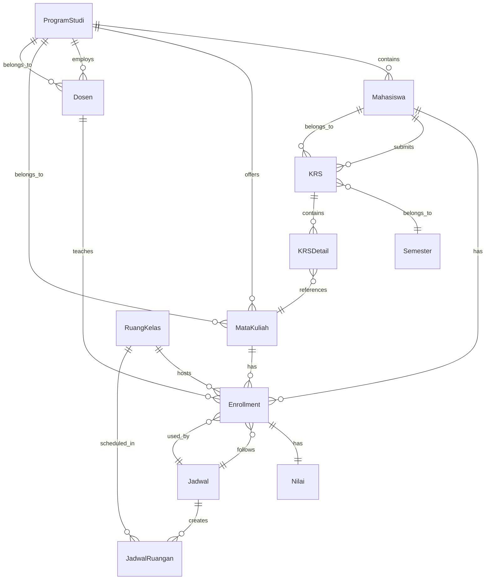

# Sistem Informasi Akademik - Implementation Plan

## Overview

This plan outlines the implementation of the Academic Information System for "Universitas Merdeka Digital" using Prisma ORM with SvelteKit backend API endpoints.

## Entity Relationship Diagram



## Database Schema Design

### Core Entities

#### 1. ProgramStudi (Study Program)
| Field | Type | Constraints | Description |
|-------|------|-------------|-------------|
| id | Int | PK, Auto-increment | Primary key |
| kode | String | Unique, Not null | Program code |
| nama | String | Not null | Program name |
| jenjang | String | Not null | Degree level - S1/S2/S3 |
| createdAt | DateTime | Default now | Creation timestamp |
| updatedAt | DateTime | Updated on change | Update timestamp |

#### 2. Mahasiswa (Student)
| Field | Type | Constraints | Description |
|-------|------|-------------|-------------|
| id | Int | PK, Auto-increment | Primary key |
| nim | String | Unique, Not null | Student ID number |
| nama | String | Not null | Full name |
| email | String | Unique, Not null | Email address |
| programStudiId | Int | FK -> ProgramStudi | Study program reference |
| angkatan | Int | Not null | Year of entry |
| status | Enum | ACTIVE/INACTIVE/GRADUATED | Student status |
| ipk | Float | Default 0.0 | Cumulative GPA |
| createdAt | DateTime | Default now | Creation timestamp |
| updatedAt | DateTime | Updated on change | Update timestamp |

#### 3. Dosen (Lecturer)
| Field | Type | Constraints | Description |
|-------|------|-------------|-------------|
| id | Int | PK, Auto-increment | Primary key |
| nip | String | Unique, Not null | Lecturer ID number |
| nama | String | Not null | Full name |
| email | String | Unique, Not null | Email address |
| programStudiId | Int | FK -> ProgramStudi | Department reference |
| jabatan | String | Not null | Position/title |
| createdAt | DateTime | Default now | Creation timestamp |
| updatedAt | DateTime | Updated on change | Update timestamp |

#### 4. MataKuliah (Course)
| Field | Type | Constraints | Description |
|-------|------|-------------|-------------|
| id | Int | PK, Auto-increment | Primary key |
| kode | String | Unique, Not null | Course code |
| nama | String | Not null | Course name |
| sks | Int | Not null | Credit units |
| semester | Int | Not null | Recommended semester |
| programStudiId | Int | FK -> ProgramStudi | Offering program |
| deskripsi | String | Optional | Course description |
| createdAt | DateTime | Default now | Creation timestamp |
| updatedAt | DateTime | Updated on change | Update timestamp |

#### 5. RuangKelas (Classroom)
| Field | Type | Constraints | Description |
|-------|------|-------------|-------------|
| id | Int | PK, Auto-increment | Primary key |
| kode | String | Unique, Not null | Room code |
| nama | String | Not null | Room name |
| tipe | Enum | REGULER/LAB_KOMPUTER/LAB_BAHASA/AUDITORIUM | Room type |
| kapasitas | Int | Not null | Seating capacity |
| hasProyektor | Boolean | Default false | Has projector |
| hasAC | Boolean | Default false | Has air conditioner |
| gedung | String | Not null | Building name |
| lantai | Int | Not null | Floor number |
| status | Enum | AVAILABLE/MAINTENANCE/UNAVAILABLE | Room status |
| createdAt | DateTime | Default now | Creation timestamp |
| updatedAt | DateTime | Updated on change | Update timestamp |

#### 6. Semester
| Field | Type | Constraints | Description |
|-------|------|-------------|-------------|
| id | Int | PK, Auto-increment | Primary key |
| tahunAjaran | String | Not null | Academic year - e.g. 2024/2025 |
| semester | Enum | GANJIL/GENAP | Semester type |
| isActive | Boolean | Default false | Current active semester |
| createdAt | DateTime | Default now | Creation timestamp |
| updatedAt | DateTime | Updated on change | Update timestamp |

#### 7. Jadwal (Schedule)
| Field | Type | Constraints | Description |
|-------|------|-------------|-------------|
| id | Int | PK, Auto-increment | Primary key |
| hari | Enum | SENIN/SELASA/RABU/KAMIS/JUMAT/SABTU/MINGGU | Day of week |
| jamMulai | String | Not null | Start time - HH:mm |
| jamSelesai | String | Not null | End time - HH:mm |
| createdAt | DateTime | Default now | Creation timestamp |
| updatedAt | DateTime | Updated on change | Update timestamp |

#### 8. Enrollment (Course Enrollment)
| Field | Type | Constraints | Description |
|-------|------|-------------|-------------|
| id | Int | PK, Auto-increment | Primary key |
| mahasiswaId | Int | FK -> Mahasiswa | Student reference |
| mataKuliahId | Int | FK -> MataKuliah | Course reference |
| dosenId | Int | FK -> Dosen | Lecturer reference |
| ruangKelasId | Int | FK -> RuangKelas | Classroom reference |
| jadwalId | Int | FK -> Jadwal | Schedule reference |
| semesterId | Int | FK -> Semester | Semester reference |
| status | Enum | ACTIVE/COMPLETED/DROPPED | Enrollment status |
| createdAt | DateTime | Default now | Creation timestamp |
| updatedAt | DateTime | Updated on change | Update timestamp |

**Unique Constraint:** mahasiswaId + mataKuliahId + semesterId - prevents duplicate enrollment

#### 9. Nilai (Grade)
| Field | Type | Constraints | Description |
|-------|------|-------------|-------------|
| id | Int | PK, Auto-increment | Primary key |
| enrollmentId | Int | FK -> Enrollment, Unique | Enrollment reference |
| nilaiTugas | Float | 0-100 | Assignment score |
| nilaiUTS | Float | 0-100 | Midterm score |
| nilaiUAS | Float | 0-100 | Final exam score |
| nilaiTotal | Float | Calculated | Final score |
| hurufMutu | String | A/B+C/D/E | Grade letter |
| createdAt | DateTime | Default now | Creation timestamp |
| updatedAt | DateTime | Updated on change | Update timestamp |

**Grade Calculation Formula:**
- nilaiTotal = nilaiTugas * 0.3 + nilaiUTS * 0.3 + nilaiUAS * 0.4
- hurufMutu conversion:
  - A: 85-100
  - B+: 80-84
  - B: 75-79
  - C+: 70-74
  - C: 65-69
  - D: 50-64
  - E: 0-49

#### 10. KRS (Study Plan Card)
| Field | Type | Constraints | Description |
|-------|------|-------------|-------------|
| id | Int | PK, Auto-increment | Primary key |
| mahasiswaId | Int | FK -> Mahasiswa | Student reference |
| semesterId | Int | FK -> Semester | Semester reference |
| status | Enum | DRAFT/SUBMITTED/APPROVED/REJECTED | KRS status |
| tanggalSubmit | DateTime | Optional | Submission date |
| createdAt | DateTime | Default now | Creation timestamp |
| updatedAt | DateTime | Updated on change | Update timestamp |

**Unique Constraint:** mahasiswaId + semesterId

#### 11. KRSDetail (KRS Detail)
| Field | Type | Constraints | Description |
|-------|------|-------------|-------------|
| id | Int | PK, Auto-increment | Primary key |
| krsId | Int | FK -> KRS | KRS reference |
| mataKuliahId | Int | FK -> MataKuliah | Course reference |
| createdAt | DateTime | Default now | Creation timestamp |

**Unique Constraint:** krsId + mataKuliahId

#### 12. JadwalRuangan (Room Schedule)
| Field | Type | Constraints | Description |
|-------|------|-------------|-------------|
| id | Int | PK, Auto-increment | Primary key |
| ruangKelasId | Int | FK -> RuangKelas | Room reference |
| jadwalId | Int | FK -> Jadwal | Schedule reference |
| semesterId | Int | FK -> Semester | Semester reference |
| keterangan | String | Optional | Notes |
| createdAt | DateTime | Default now | Creation timestamp |

**Unique Constraint:** ruangKelasId + jadwalId + semesterId - prevents double booking

---

## API Endpoints Design

### Authentication - /api/auth

| Method | Endpoint | Description |
|--------|----------|-------------|
| POST | /api/auth/login | User login |
| POST | /api/auth/logout | User logout |
| GET | /api/auth/me | Get current user |

### Program Studi - /api/program-studi

| Method | Endpoint | Description |
|--------|----------|-------------|
| GET | /api/program-studi | List all programs |
| GET | /api/program-studi/:id | Get program by ID |
| POST | /api/program-studi | Create new program |
| PUT | /api/program-studi/:id | Update program |
| DELETE | /api/program-studi/:id | Delete program |

### Mahasiswa - /api/mahasiswa

| Method | Endpoint | Description |
|--------|----------|-------------|
| GET | /api/mahasiswa | List all students with pagination |
| GET | /api/mahasiswa/:id | Get student by ID with IPK |
| GET | /api/mahasiswa/:id/enrollments | Get student enrollments |
| GET | /api/mahasiswa/:id/nilai | Get student grades |
| GET | /api/mahasiswa/:id/krs | Get student KRS |
| POST | /api/mahasiswa | Create new student |
| PUT | /api/mahasiswa/:id | Update student |
| DELETE | /api/mahasiswa/:id | Delete student |

### Dosen - /api/dosen

| Method | Endpoint | Description |
|--------|----------|-------------|
| GET | /api/dosen | List all lecturers |
| GET | /api/dosen/:id | Get lecturer by ID |
| GET | /api/dosen/:id/enrollments | Get lecturer courses |
| POST | /api/dosen | Create new lecturer |
| PUT | /api/dosen/:id | Update lecturer |
| DELETE | /api/dosen/:id | Delete lecturer |

### Mata Kuliah - /api/mata-kuliah

| Method | Endpoint | Description |
|--------|----------|-------------|
| GET | /api/mata-kuliah | List all courses |
| GET | /api/mata-kuliah/:id | Get course by ID |
| POST | /api/mata-kuliah | Create new course |
| PUT | /api/mata-kuliah/:id | Update course |
| DELETE | /api/mata-kuliah/:id | Delete course |

### Ruang Kelas - /api/ruang-kelas

| Method | Endpoint | Description |
|--------|----------|-------------|
| GET | /api/ruang-kelas | List all classrooms |
| GET | /api/ruang-kelas/:id | Get classroom by ID |
| GET | /api/ruang-kelas/:id/jadwal | Get classroom schedule |
| GET | /api/ruang-kelas/available | Check room availability |
| GET | /api/ruang-kelas/utilization | Get utilization report |
| POST | /api/ruang-kelas | Create new classroom |
| PUT | /api/ruang-kelas/:id | Update classroom |
| DELETE | /api/ruang-kelas/:id | Delete classroom |

### Semester - /api/semester

| Method | Endpoint | Description |
|--------|----------|-------------|
| GET | /api/semester | List all semesters |
| GET | /api/semester/active | Get active semester |
| GET | /api/semester/:id | Get semester by ID |
| POST | /api/semester | Create new semester |
| PUT | /api/semester/:id | Update semester |
| PUT | /api/semester/:id/activate | Set as active semester |
| DELETE | /api/semester/:id | Delete semester |

### Jadwal - /api/jadwal

| Method | Endpoint | Description |
|--------|----------|-------------|
| GET | /api/jadwal | List all schedules |
| GET | /api/jadwal/:id | Get schedule by ID |
| POST | /api/jadwal | Create new schedule |
| PUT | /api/jadwal/:id | Update schedule |
| DELETE | /api/jadwal/:id | Delete schedule |

### Enrollment - /api/enrollment

| Method | Endpoint | Description |
|--------|----------|-------------|
| GET | /api/enrollment | List all enrollments |
| GET | /api/enrollment/:id | Get enrollment by ID |
| GET | /api/enrollment/check-conflict | Check schedule conflict |
| POST | /api/enrollment | Create new enrollment |
| PUT | /api/enrollment/:id | Update enrollment |
| DELETE | /api/enrollment/:id | Delete enrollment |

### Nilai - /api/nilai

| Method | Endpoint | Description |
|--------|----------|-------------|
| GET | /api/nilai | List all grades |
| GET | /api/nilai/:id | Get grade by ID |
| GET | /api/nilai/enrollment/:enrollmentId | Get grade by enrollment |
| POST | /api/nilai | Create/Update grade |
| PUT | /api/nilai/:id | Update grade |
| DELETE | /api/nilai/:id | Delete grade |

### KRS - /api/krs

| Method | Endpoint | Description |
|--------|----------|-------------|
| GET | /api/krs | List all KRS |
| GET | /api/krs/:id | Get KRS by ID with details |
| POST | /api/krs | Create new KRS |
| POST | /api/krs/:id/add-course | Add course to KRS |
| DELETE | /api/krs/:id/remove-course | Remove course from KRS |
| PUT | /api/krs/:id/submit | Submit KRS |
| PUT | /api/krs/:id/approve | Approve KRS |
| PUT | /api/krs/:id/reject | Reject KRS |
| DELETE | /api/krs/:id | Delete KRS |

---

## Migration Strategy: Mikro-ORM to Prisma

### Steps

1. **Remove Mikro-ORM Dependencies**
   - Uninstall @mikro-orm/core, @mikro-orm/decorators, @mikro-orm/mysql
   - Delete mikro-orm.config.ts
   - Delete src/lib/server/database/entities/ directory

2. **Install Prisma**
   - Install prisma and @prisma/client
   - Initialize Prisma with MySQL

3. **Create Prisma Schema**
   - Define all models in prisma/schema.prisma
   - Set up relations and indexes

4. **Update Database Configuration**
   - Create Prisma client instance
   - Update environment variables

5. **Remove Old Entity Files**
   - Clean up Mikro-ORM entity definitions
   - Remove async-context files if not needed

---

## Project Structure

```
sqlproject/
├── prisma/
│   ├── schema.prisma          # Prisma schema definition
│   └── seed.ts                # Database seeding
├── src/
│   ├── lib/
│   │   ├── server/
│   │   │   ├── prisma.ts      # Prisma client instance
│   │   │   └── api/
│   │   │       ├── program-studi/
│   │   │       ├── mahasiswa/
│   │   │       ├── dosen/
│   │   │       ├── mata-kuliah/
│   │   │       ├── ruang-kelas/
│   │   │       ├── semester/
│   │   │       ├── jadwal/
│   │   │       ├── enrollment/
│   │   │       ├── nilai/
│   │   │       └── krs/
│   │   └── utils/
│   │       └── grade-calculator.ts
│   └── routes/
│       └── api/
│           ├── auth/
│           ├── program-studi/
│           ├── mahasiswa/
│           ├── dosen/
│           ├── mata-kuliah/
│           ├── ruang-kelas/
│           ├── semester/
│           ├── jadwal/
│           ├── enrollment/
│           ├── nilai/
│           └── krs/
├── .env                       # Environment variables
└── package.json
```

---

## Key Business Logic

### 1. Schedule Conflict Prevention
When creating an enrollment, the system must check:
- Same student cannot have overlapping schedules
- Same room cannot be double-booked for the same time slot

### 2. Grade Calculation
Automatic calculation of:
- Total score from weighted components
- Letter grade conversion
- GPA/IPK recalculation when grades change

### 3. Room Utilization Tracking
- Track usage frequency per room
- Generate utilization reports

### 4. KRS Workflow
- Draft -> Submitted -> Approved/Rejected
- Maximum credit limit per semester
- Prerequisite course validation - optional

---

## Implementation Priority

1. **Phase 1: Core Setup**
   - Prisma installation and configuration
   - Database schema creation
   - Basic CRUD for all entities

2. **Phase 2: Business Logic**
   - Grade calculation service
   - Schedule conflict detection
   - IPK calculation

3. **Phase 3: Advanced Features**
   - Room utilization reporting
   - KRS workflow implementation
   - Data validation and constraints
